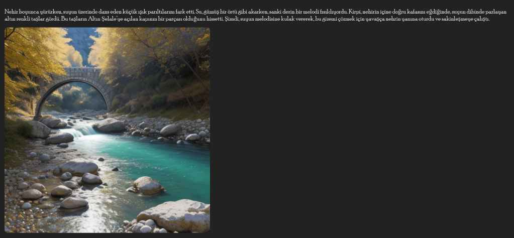

# 🎬 Multimodal Story Generator — Multi-Scene Edition

> **AI-powered storytelling:** Enter a topic, get a cinematic 8-scene illustrated story — powered by GPT-4o-mini, BLIP-2, and Stable Diffusion (DreamShaper-8).

---

## 🔥 Demo Output

The generator produces a complete visual story from a simple text prompt:



*Scene from the story "Büyülü Ormanda Altın Şelale" (The Golden Waterfall in the Enchanted Forest) — AI-generated image via DreamShaper-8.*

---

## 🧠 How It Works

```
User Prompt (text + optional image)
        ↓
  [ BLIP-2 ] — Analyzes optional inspiration image → visual description
        ↓
  [ GPT-4o-mini ] — Generates 8-scene story as structured JSON
        ↓
  [ DreamShaper-8 ] — Generates one illustration per scene
        ↓
  [ Gradio UI ] — Interactive web app + HTML story export
```

### AI Models Used

| Model | Provider | Role |
|---|---|---|
| **GPT-4o-mini** | OpenAI | Story generation (structured JSON with scenes) |
| **BLIP-2** (`Salesforce/blip2-opt-2.7b`) | Hugging Face | Image captioning for optional input |
| **DreamShaper-8** (`Lykon/dreamshaper-8`) | Hugging Face / Stable Diffusion | Scene illustration |

---

## ✨ Key Features

- **8 cinematic scenes** — Each with detailed narrative text (80–100+ words) and an AI-generated illustration
- **Consistent character design** — Character description defined once, reused via `[CHARACTER]` placeholder across all scenes
- **Smart scene variety** — At least 4 scenes are pure landscape shots (no character), alternating with character shots
- **Optional image input** — Upload an inspiration image; BLIP-2 analyzes it and weaves it into the story
- **HTML export** — Download the full illustrated story as a self-contained `.html` file
- **Public sharing** — Runs on Google Colab with a shareable `*.gradio.live` link

---

## 🚀 Getting Started (Google Colab)

### 1. Open the Notebook

Upload `Multimodal_Story_Generator.ipynb` to [Google Colab](https://colab.research.google.com/) and **enable GPU**:
> `Runtime → Change runtime type → T4 GPU`

### 2. Install Dependencies

Run **Cell 1** — installs all required packages:

```bash
pip install opencv-python transformers accelerate bitsandbytes diffusers gradio openai safetensors
```

### 3. Enter Your OpenAI API Key

Run **Cell 2** — you'll be securely prompted for your key:

```
Enter your OpenAI API Key: sk-...
```

> 💡 Don't have a key? Test yours first with `test_api.py` (see below).

### 4. Load AI Models

Run **Cell 3** — loads BLIP-2 and DreamShaper-8 (~5–10 min on first run; models are cached).

### 5. Run the App

Run **Cells 4 & 5** — launches the Gradio interface. Wait for a link like:

```
Running on public URL: https://xxxxxxxx.gradio.live
```

Click the link, enter your story topic, and generate!

---

## 🔑 Testing Your OpenAI API Key

Before running the full notebook, verify your key is active:

```bash
python test_api.py
```

The script will:
- Prompt you securely for your API key
- Make a lightweight API call (`models.list`)
- Report success or diagnose errors (quota, invalid key, etc.)

---

## 📁 Project Structure

```
📦 Multimodal-Story-Generator/
 ┣ 📓 Multimodal_Story_Generator.ipynb   # Main notebook (run on Colab)
 ┣ 🐍 test_api.py                         # OpenAI API key tester
 ┣ 🖼️  demo_output.jpg                    # Sample AI-generated story scene
 ┗ 📄 README.md
```

---

## ⚙️ Technical Details

| Component | Detail |
|---|---|
| Story format | JSON: `title`, `consistent_visual_style`, `character_design`, `scenes[]` |
| Image resolution | 512×512 (Stable Diffusion 1.5 base) |
| Inference steps | 30 steps, guidance scale 7.5 |
| Prompt length cap | 350 characters per scene |
| Negative prompt | Removes bad artifacts, watermarks, distorted hands |

---

## 📋 Requirements

- Google Colab account with **GPU** enabled (T4 recommended)
- OpenAI API key with GPT-4o-mini access
- ~8 GB GPU VRAM

---

## 📜 License

MIT License — free to use and modify.
